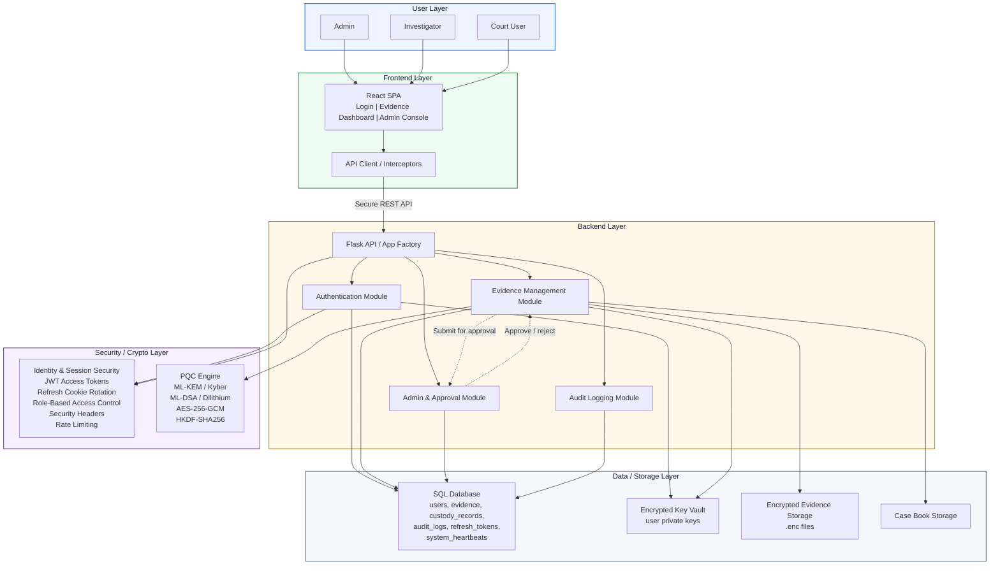

# High-Level Architecture Diagram

## Diagram Notes

- All user roles access the system through the React frontend.
- The React frontend communicates with the Flask backend through secure REST APIs.
- Authentication and authorization are enforced through JWT, refresh cookies, role-based access control, security headers, and rate limiting.
- The evidence module uses the PQC engine to encrypt evidence and sign related metadata before storage.
- Metadata, custody records, audit logs, and session data are stored in the SQL database.
- Court users access only approved or explicitly court-authorized evidence.
