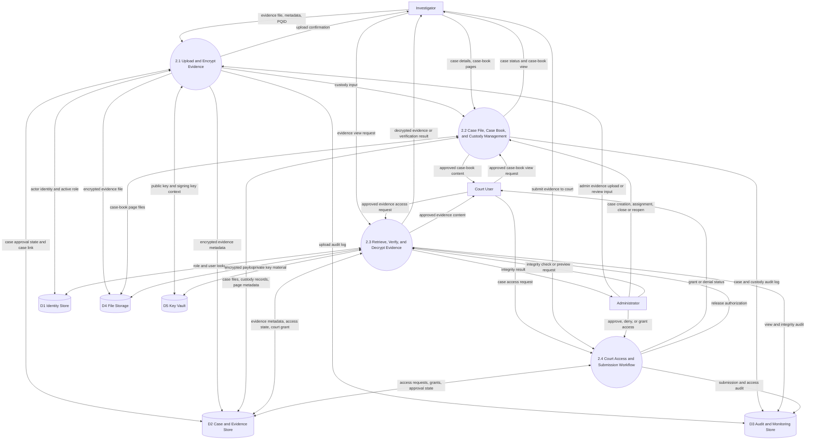

# One Detailed Level 2 DFD for PQC Evidence Storing System

This file contains only one Level 2 DFD.

Use this as the final Level 2 diagram for the project report.

It decomposes `2.0 Case and Evidence Operations` into four detailed subprocesses.

## Code Basis

This diagram was aligned to the current implementation:

- `backend/app/routes/evidence.py`
- `backend/app/models/case_file.py`
- `backend/app/models/evidence.py`
- `backend/app/models/court_access.py`
- `backend/app/models/user.py`
- `backend/app/security/key_vault.py`
- `backend/app/modules/pqc_engine.py`

## Export Tip

If you want a visual file:

1. Open draw.io
2. Go to `Arrange -> Insert -> Advanced -> Mermaid`
3. Paste the Mermaid block above
4. Restyle entities as rectangles, processes as circles, and data stores as open-ended stores if your report format requires classic DFD notation
