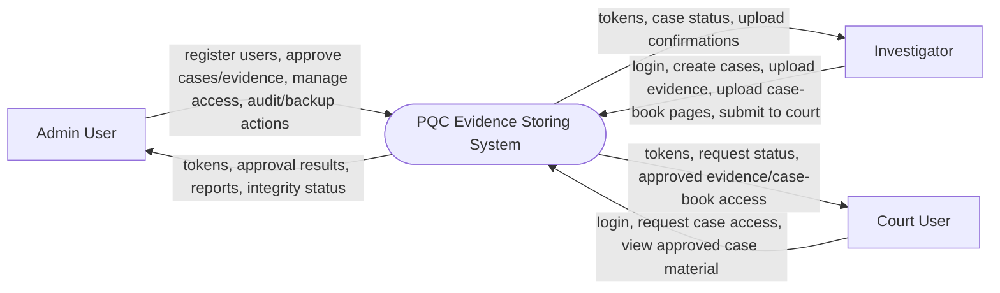
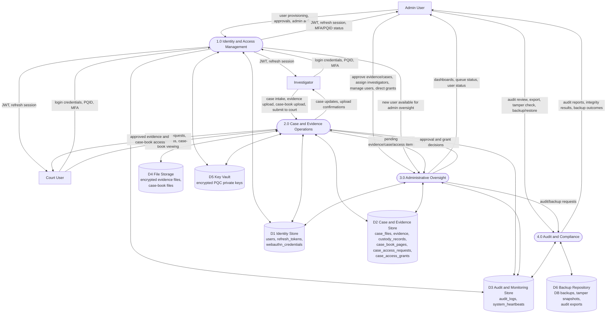
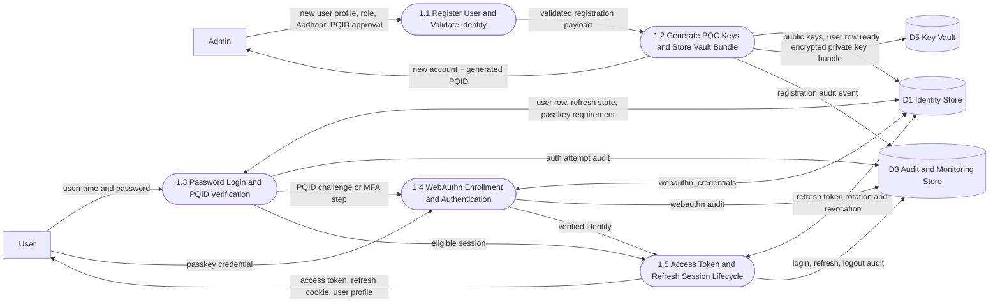
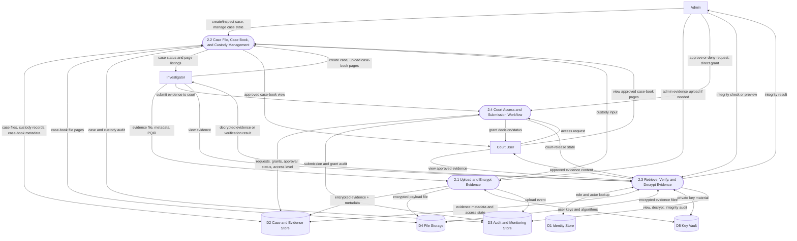
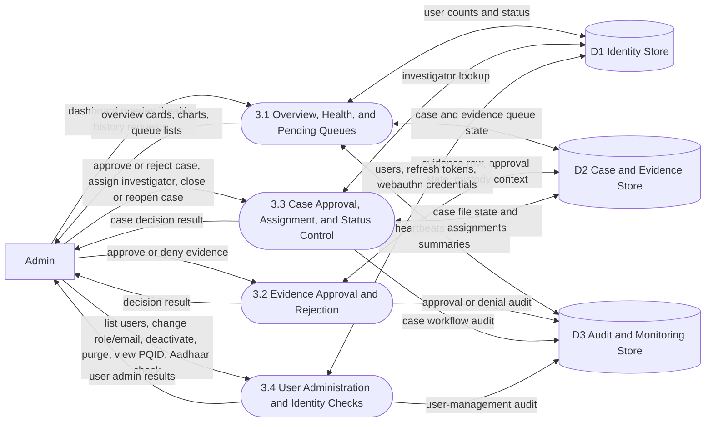
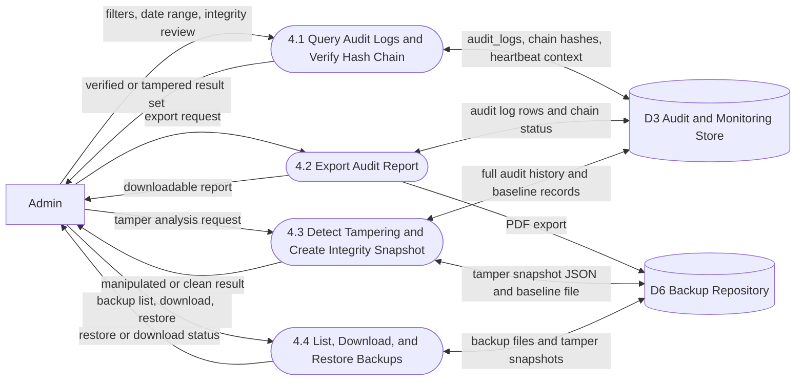
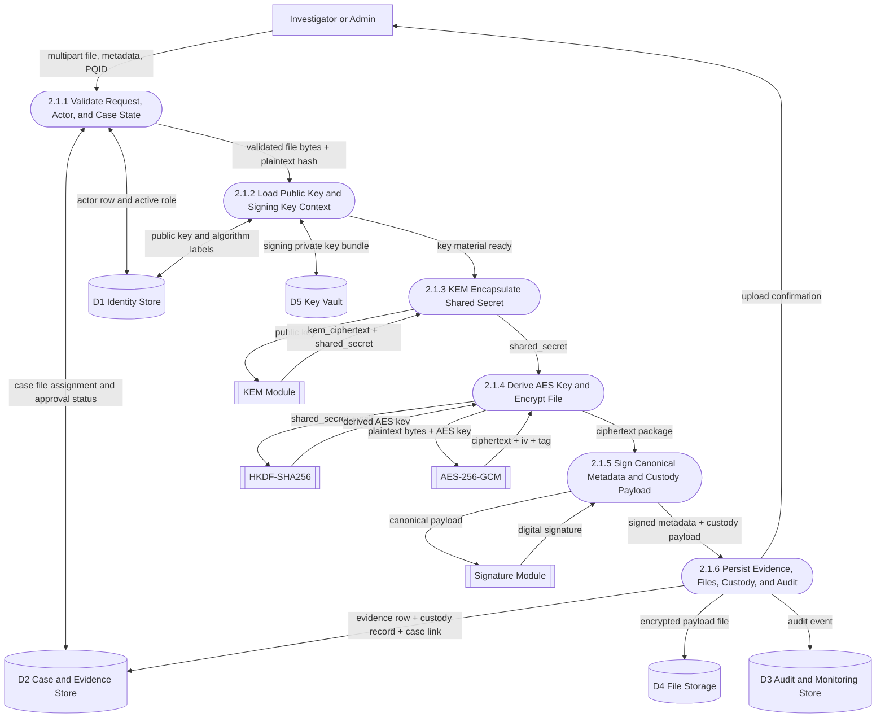
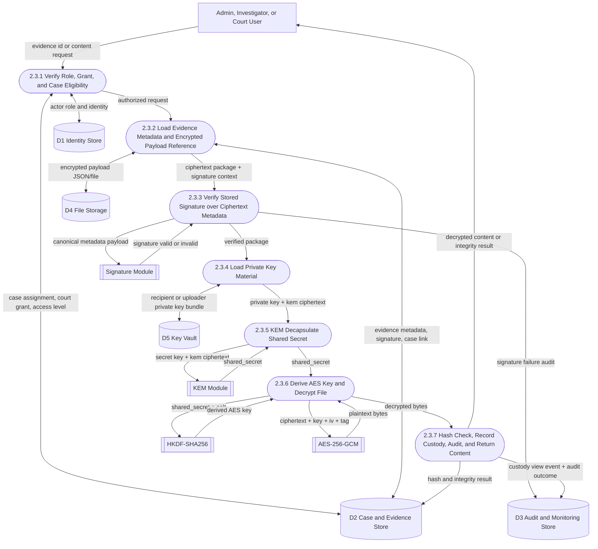

# DFD Mermaid Figures

These Mermaid flowcharts are code-backed for the current project state.

For a simpler, standard report-style logical DFD, use `docs/DFD_MERMAID_SIMPLE.md`.

Figure list:

1. Context Diagram - PQC Evidence Storing System
2. Level 0 DFD - Core Processes and Data Stores
3. Level 1 DFD - Process 1.0 Identity and Access Management
4. Level 1 DFD - Process 2.0 Case and Evidence Operations
5. Level 1 DFD - Process 3.0 Administrative Oversight
6. Level 1 DFD - Process 4.0 Audit and Compliance
7. Level 2 DFD - Process 2.1 Upload and Encrypt Evidence
8. Level 2 DFD - Process 2.3 Retrieve, Verify, and Decrypt Evidence

Note:
- I use Mermaid `flowchart` because Mermaid does not have a native DFD diagram type.
- I use 6 logical stores in the corrected diagrams because the codebase has a distinct backup repository in addition to the main DB, file storage, and key vault.

## 1. Context Diagram - PQC Evidence Storing System

## 2. Level 0 DFD - Core Processes and Data Stores

## 3. Level 1 DFD - Process 1.0 Identity and Access Management

## 4. Level 1 DFD - Process 2.0 Case and Evidence Operations

## 5. Level 1 DFD - Process 3.0 Administrative Oversight

## 6. Level 1 DFD - Process 4.0 Audit and Compliance

## 7. Level 2 DFD - Process 2.1 Upload and Encrypt Evidence

## 8. Level 2 DFD - Process 2.3 Retrieve, Verify, and Decrypt Evidence

