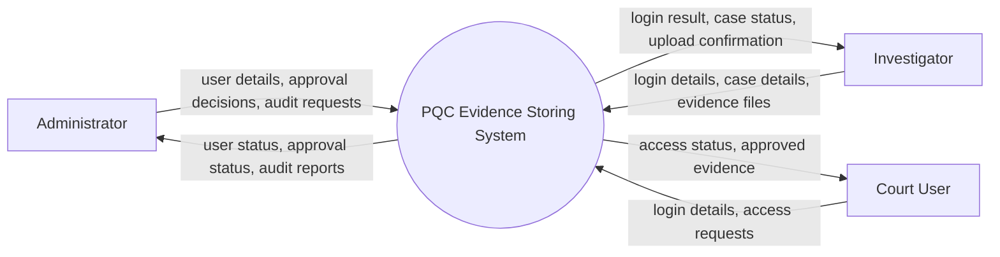
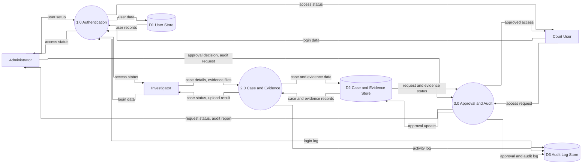
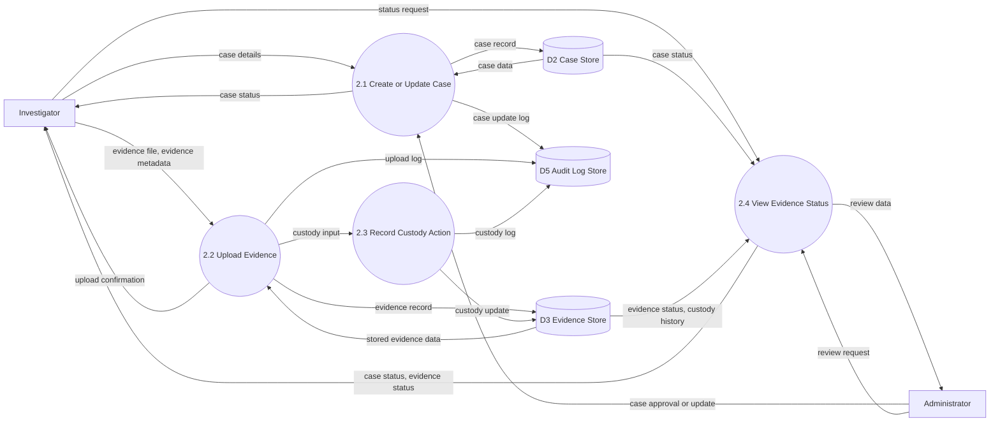

# Simple Logical DFD Mermaid

This file contains simplified, standard DFD-style Mermaid code for the PQC Evidence Storing System.

Use these as report-friendly diagrams:

- Level 0 DFD = Context Diagram
- Level 1 DFD = Major internal processes and data stores
- Level 2 DFD = Decomposition of one Level 1 process

These diagrams are intentionally logical, not technical:

- They show what data moves through the system
- They avoid implementation details such as AES, KEM, key vault internals, and API endpoints
- They use short labels so they paste more cleanly into draw.io Mermaid import

## 1. Level 0 DFD (Context Diagram)

## 2. Level 1 DFD

## 3. Level 2 DFD for Process 2.0 Case and Evidence Management

## Draw.io Tip

In draw.io:

1. Go to `Arrange -> Insert -> Advanced -> Mermaid`
2. Paste one Mermaid block at a time
3. After import, restyle shapes manually to match DFD notation if needed

If you want the cleanest classroom-style DFD, use:

- rectangles for external entities
- circles or rounded shapes for processes
- open-ended or parallel-line style boxes for data stores
- labeled arrows for data flow
