# Chen-Style ER Diagram Mermaid

This version follows the Chen-style ER approach more closely:
- entities as rectangles
- attributes as oval-like nodes
- relationships as diamonds
- cardinalities shown on connecting lines

Note:
- Mermaid does not support true double ovals, double rectangles, or underlined key attributes exactly like textbook ER notation.
- This is the closest clean Mermaid approximation for the current project schema.

```mermaid
%%{init: {'flowchart': {'curve': 'linear'}}}%%
flowchart LR

    %% ========= ENTITIES =========
    USER[USER]
    CASE_FILE[CASE_FILE]
    EVIDENCE[EVIDENCE]
    CUSTODY_RECORD[CUSTODY_RECORD]
    CASE_BOOK_PAGE[CASE_BOOK_PAGE]
    CASE_ACCESS_REQUEST[CASE_ACCESS_REQUEST]
    CASE_ACCESS_GRANT[CASE_ACCESS_GRANT]
    REFRESH_TOKEN[REFRESH_TOKEN]
    WEBAUTHN_CREDENTIAL[WEBAUTHN_CREDENTIAL]
    AUDIT_LOG[AUDIT_LOG]
    SYSTEM_HEARTBEAT[SYSTEM_HEARTBEAT]

    %% ========= USER ATTRIBUTES =========
    u1([user_id PK])
    u2([username])
    u3([email])
    u4([role])
    u5([pqid])
    u6([is_active])
    u7([aadhar_hash])

    USER --- u1
    USER --- u2
    USER --- u3
    USER --- u4
    USER --- u5
    USER --- u6
    USER --- u7

    %% ========= CASE FILE ATTRIBUTES =========
    c1([case_file_id PK])
    c2([case_number])
    c3([quantum_ledger_number])
    c4([case_title])
    c5([status])
    c6([approval_status])
    c7([created_at])

    CASE_FILE --- c1
    CASE_FILE --- c2
    CASE_FILE --- c3
    CASE_FILE --- c4
    CASE_FILE --- c5
    CASE_FILE --- c6
    CASE_FILE --- c7

    %% ========= EVIDENCE ATTRIBUTES =========
    e1([evidence_id PK])
    e2([case_id])
    e3([filename])
    e4([file_hash])
    e5([file_size])
    e6([access_level])
    e7([approval_status])
    e8([uploaded_at])

    EVIDENCE --- e1
    EVIDENCE --- e2
    EVIDENCE --- e3
    EVIDENCE --- e4
    EVIDENCE --- e5
    EVIDENCE --- e6
    EVIDENCE --- e7
    EVIDENCE --- e8

    %% ========= CUSTODY RECORD ATTRIBUTES =========
    cr1([custody_id PK])
    cr2([action])
    cr3([timestamp])
    cr4([ip_address])
    cr5([signature])

    CUSTODY_RECORD --- cr1
    CUSTODY_RECORD --- cr2
    CUSTODY_RECORD --- cr3
    CUSTODY_RECORD --- cr4
    CUSTODY_RECORD --- cr5

    %% ========= CASE BOOK PAGE ATTRIBUTES =========
    cb1([page_id PK])
    cb2([page_number])
    cb3([filename])
    cb4([mime_type])
    cb5([file_hash])
    cb6([stored_path])
    cb7([created_at])

    CASE_BOOK_PAGE --- cb1
    CASE_BOOK_PAGE --- cb2
    CASE_BOOK_PAGE --- cb3
    CASE_BOOK_PAGE --- cb4
    CASE_BOOK_PAGE --- cb5
    CASE_BOOK_PAGE --- cb6
    CASE_BOOK_PAGE --- cb7

    %% ========= CASE ACCESS REQUEST ATTRIBUTES =========
    rq1([request_id PK])
    rq2([requested_duration_minutes])
    rq3([status])
    rq4([reason])
    rq5([created_at])
    rq6([decided_at])

    CASE_ACCESS_REQUEST --- rq1
    CASE_ACCESS_REQUEST --- rq2
    CASE_ACCESS_REQUEST --- rq3
    CASE_ACCESS_REQUEST --- rq4
    CASE_ACCESS_REQUEST --- rq5
    CASE_ACCESS_REQUEST --- rq6

    %% ========= CASE ACCESS GRANT ATTRIBUTES =========
    cg1([grant_id PK])
    cg2([granted_at])
    cg3([expires_at])
    cg4([revoked_at])
    cg5([revoke_reason])

    CASE_ACCESS_GRANT --- cg1
    CASE_ACCESS_GRANT --- cg2
    CASE_ACCESS_GRANT --- cg3
    CASE_ACCESS_GRANT --- cg4
    CASE_ACCESS_GRANT --- cg5

    %% ========= REFRESH TOKEN ATTRIBUTES =========
    rt1([token_id PK])
    rt2([jti_hash])
    rt3([expires_at])
    rt4([revoked_at])
    rt5([created_at])

    REFRESH_TOKEN --- rt1
    REFRESH_TOKEN --- rt2
    REFRESH_TOKEN --- rt3
    REFRESH_TOKEN --- rt4
    REFRESH_TOKEN --- rt5

    %% ========= WEBAUTHN ATTRIBUTES =========
    w1([webauthn_id PK])
    w2([credential_id])
    w3([public_key])
    w4([sign_count])
    w5([is_active])

    WEBAUTHN_CREDENTIAL --- w1
    WEBAUTHN_CREDENTIAL --- w2
    WEBAUTHN_CREDENTIAL --- w3
    WEBAUTHN_CREDENTIAL --- w4
    WEBAUTHN_CREDENTIAL --- w5

    %% ========= AUDIT LOG ATTRIBUTES =========
    a1([log_id PK])
    a2([action])
    a3([resource_type])
    a4([status])
    a5([timestamp])
    a6([prev_hash])
    a7([current_hash])

    AUDIT_LOG --- a1
    AUDIT_LOG --- a2
    AUDIT_LOG --- a3
    AUDIT_LOG --- a4
    AUDIT_LOG --- a5
    AUDIT_LOG --- a6
    AUDIT_LOG --- a7

    %% ========= HEARTBEAT ATTRIBUTES =========
    h1([heartbeat_id PK])
    h2([beat_minute])
    h3([load_pct])

    SYSTEM_HEARTBEAT --- h1
    SYSTEM_HEARTBEAT --- h2
    SYSTEM_HEARTBEAT --- h3

    %% ========= RELATIONSHIPS =========
    R1{CREATES_CASE}
    R2{ASSIGNED_TO_CASE}
    R3{APPROVES_CASE}
    R4{UPLOADS_EVIDENCE}
    R5{CASE_HAS_EVIDENCE}
    R6{EVIDENCE_HAS_CUSTODY}
    R7{USER_WRITES_CUSTODY}
    R8{CASE_HAS_PAGES}
    R9{USER_UPLOADS_PAGE}
    R10{SUBMITS_REQUEST}
    R11{DECIDES_REQUEST}
    R12{REQUEST_FOR_CASE}
    R13{GRANTS_ACCESS}
    R14{RECEIVES_ACCESS}
    R15{GRANT_FOR_CASE}
    R16{SOURCE_OF_GRANT}
    R17{OWNS_REFRESH_TOKEN}
    R18{OWNS_WEBAUTHN}
    R19{WRITES_AUDIT_LOG}

    %% USER <-> CASE_FILE
    USER -- "1" --- R1
    R1 -- "N" --- CASE_FILE

    USER -- "1" --- R2
    R2 -- "N" --- CASE_FILE

    USER -- "1" --- R3
    R3 -- "N" --- CASE_FILE

    %% USER <-> EVIDENCE
    USER -- "1" --- R4
    R4 -- "N" --- EVIDENCE

    CASE_FILE -- "1" --- R5
    R5 -- "N" --- EVIDENCE

    %% EVIDENCE <-> CUSTODY
    EVIDENCE -- "1" --- R6
    R6 -- "N" --- CUSTODY_RECORD

    USER -- "1" --- R7
    R7 -- "N" --- CUSTODY_RECORD

    %% CASE_FILE <-> CASE_BOOK_PAGE
    CASE_FILE -- "1" --- R8
    R8 -- "N" --- CASE_BOOK_PAGE

    USER -- "1" --- R9
    R9 -- "N" --- CASE_BOOK_PAGE

    %% USER <-> REQUEST
    USER -- "1" --- R10
    R10 -- "N" --- CASE_ACCESS_REQUEST

    USER -- "1" --- R11
    R11 -- "N" --- CASE_ACCESS_REQUEST

    CASE_FILE -- "1" --- R12
    R12 -- "N" --- CASE_ACCESS_REQUEST

    %% GRANTS
    USER -- "1" --- R13
    R13 -- "N" --- CASE_ACCESS_GRANT

    USER -- "1" --- R14
    R14 -- "N" --- CASE_ACCESS_GRANT

    CASE_FILE -- "1" --- R15
    R15 -- "N" --- CASE_ACCESS_GRANT

    CASE_ACCESS_REQUEST -- "0..1" --- R16
    R16 -- "0..N" --- CASE_ACCESS_GRANT

    %% AUTH TABLES
    USER -- "1" --- R17
    R17 -- "N" --- REFRESH_TOKEN

    USER -- "1" --- R18
    R18 -- "N" --- WEBAUTHN_CREDENTIAL

    %% AUDIT + MONITORING
    USER -- "0..1" --- R19
    R19 -- "N" --- AUDIT_LOG
```

