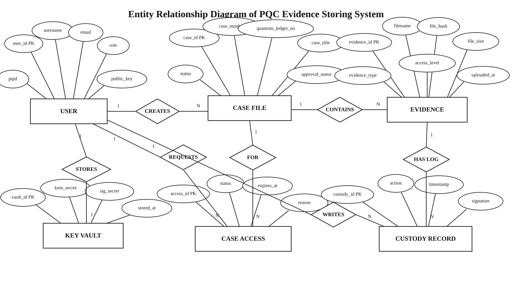

# Clean Chen-Style ER Diagram For Report

Use this version for the final report submission:

Direct file:

`docs/ER_DIAGRAM_CHEN_CLEAN.svg`

## Figure Title

**Entity Relationship Diagram of PQC Evidence Storing System**

## Included Entities

- `USER`
- `CASE FILE`
- `EVIDENCE`
- `KEY VAULT`
- `CASE ACCESS`
- `CUSTODY RECORD`

## Included Relationships

- `USER` creates `CASE FILE`
- `CASE FILE` contains `EVIDENCE`
- `USER` stores private key material in `KEY VAULT`
- `USER` requests `CASE ACCESS`
- `CASE ACCESS` is for a `CASE FILE`
- `EVIDENCE` has `CUSTODY RECORD`
- `USER` writes `CUSTODY RECORD`

## Report Note

This diagram is intentionally simplified so it stays clean like a textbook Chen ER diagram. Implementation support tables are not shown because they would make the report figure too crowded.
