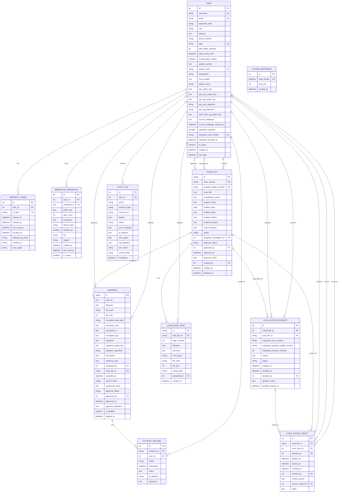

# ER Diagram Mermaid

This ER diagram reflects the current SQLAlchemy models in the project.

Notes:
- This is a database ER diagram, so filesystem storage and the encrypted key vault are not modeled as tables.
- `AuditLog.resource_id` is polymorphic text, not a foreign key, so those links are not shown as hard ER relationships.

