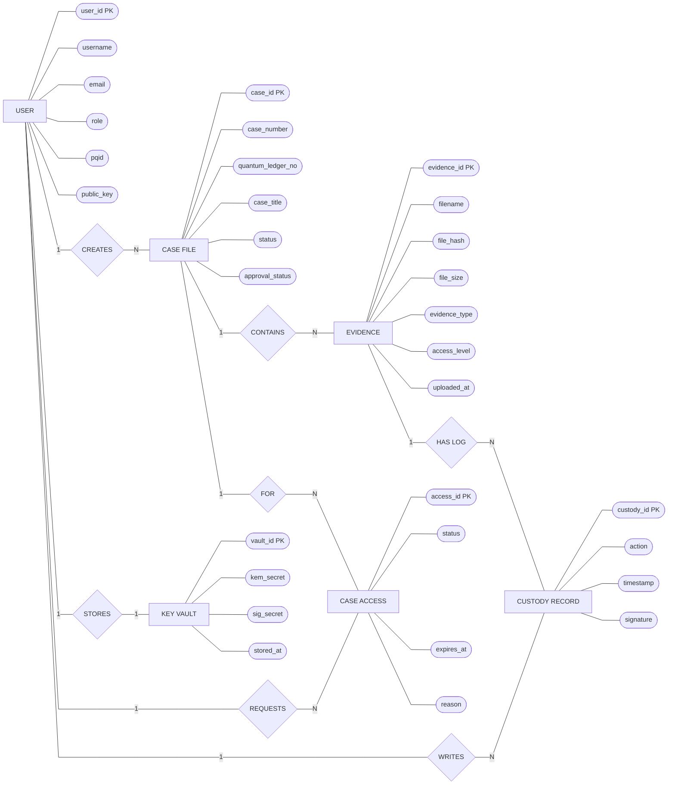

# Report-Friendly ER Diagram

## Recommended Figure Title

**Entity Relationship Diagram of PQC Evidence Storing System**

## Final Diagram For Report

Use this SVG image for the report. It follows the same clean Chen-style format as the guide sample:

Open directly:

`docs/ER_DIAGRAM_CHEN_CLEAN.svg`

## Why This Version Is Suitable

- Rectangles show entities.
- Ovals show attributes.
- Diamonds show relationships.
- `PK` marks primary key attributes.
- Cardinalities are written as `1` and `N` near the relationship lines.
- Only the important project entities are included, so the diagram is neat and readable.

## Main Entities Included

- `USER`
- `CASE FILE`
- `EVIDENCE`
- `KEY VAULT`
- `CASE ACCESS`
- `CUSTODY RECORD`

Support tables such as refresh tokens, passkey credentials, system heartbeat records, and detailed audit logs are intentionally excluded from the report diagram. They are implementation support tables, and including them would make the ER diagram unnecessarily crowded.

## Mermaid Editing Version

Mermaid cannot render perfect textbook Chen notation, but this version is useful if you need to edit the diagram quickly in Markdown.

## Code Basis

This diagram is based on:

- `backend/app/models/user.py`
- `backend/app/models/case_file.py`
- `backend/app/models/evidence.py`
- `backend/app/models/case_book_page.py`
- `backend/app/models/court_access.py`
- `backend/app/security/key_vault.py`
